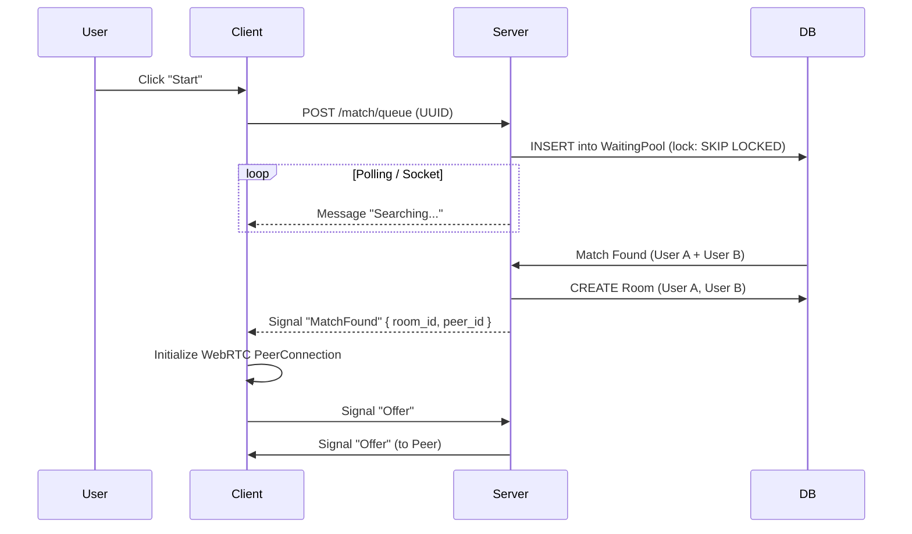

# Whispr — Product Requirements Document (PRD v4.0)

> [!IMPORTANT]
> **Status:** Launch-Hardened / Engineering Ready
> **Class:** Anonymous Real-Time Communication Platform
> **Tagline:** Talk freely. Leave no trace.

---

## 1. Product Vision & Principles

**Whispr** is a safety-first anonymous chat platform designed for spontaneous human connection—without profiles, history, or identity baggage. Unlike legacy "random chat" sites, Whispr treats safety and performance as first-class product features, not afterthoughts.

### 1.1 Core Principles (Non-Negotiable)
1.  **Ephemeral by Default:** Data exists only as long as the WebSocket connection is alive. No chat logs are ever persisted to disk.
2.  **Consent as a Gate:** Users must explicitly opt-in to video. The camera is *never* on by default.
3.  **Atomic Privacy:** No user accounts. No email collection. Identity is ephemeral (UUID) and recycled per session.
4.  **Degrade Gracefully:** If video fails (NAT/Firewall), the experience seamlessly downgrades to text. The app never "crashes" due to network conditions.

---

## 2. User Experience Flows

### 2.1 The "Golden Path" (Happy Path)
1.  **Landing:** User lands on homepage. Consent Modal appears immediately.
2.  **Consent:** User accepts >16 age limit and rules.
3.  **Setup:** User selects "Text" or "Video".
    -   *If Video:* Browser permissions requested. Access granted → Preview shown.
4.  **Queue:** User clicks "Find Partner". Enters Global Waiting Pool.
5.  **Match:** Server pairs User A + User B.
6.  **Connection:** P2P WebRTC Handshake initiates.
7.  **Interaction:** Video/Text connect. Timer starts (optional).
8.  **Exit:** User clicks "Next", "Stop", or closes tab. Connection severed immediately.

### 2.2 Matchmaking Flow Diagram

---

## 3. Product & Feature Specifications

### 3.1 Anonymous Session Lifecycle
-   **Definition:** A session is defined by a V4 UUID generated entirely client-side on page load.
-   **Storage:** Stored in `sessionStorage` (cleared on tab close).
-   **Persistence:** NOT in `localStorage`. If a user refreshes, they are a "new" user (with a new UUID) to ensuring true anonymity, though this resets their reputation score effectively cleaning their slate (accepted trade-off).

### 3.2 Consent Gate (Mandatory)
-   **Behavior:** Modal overlay blocking all interaction.
-   **Checkboxes:**
    -   [ ] I am 16+ years old.
    -   [ ] I agree to the No Nudity/Harassment Policy.
-   **Persistence:** State saved in `sessionStorage`. Must re-accept on new tab.

### 3.3 Matchmaking Logic
-   **Algorithm:** First-In-First-Matched (FIFO) with complexity layers.
-   **Constraints:**
    -   `User A != User B` (No self-match)
    -   `LastMatch != CurrentMatch` (Prevent immediate rematch with same person).
-   **Timeout:** If no match in **30 seconds**, show "Expand Search" or "Waiting for more users" toast.

### 3.4 Video & Audio (WebRTC)
-   **Default State:** Camera OFF, Mic OFF.
-   **Resolution:** Cap at 720p (mobile-data friendly).
-   **Bitrate:** Adaptive (start 500kbps, max 1.5Mbps).
-   **Turn Server:** **MANDATORY** implementation.
    -   *Logic:* Try P2P (Host) -> Try P2P (Srflx) -> Fallback to TURN (Relay).
    -   *Requirement:* If TURN is required but quota exceeded, fail gracefully to Text-Only mode.

### 3.5 Text Chat
-   **Transport:** WebRTC DataChannel (Primary) -> WebSocket Fallback (Secondary).
-   **Security:** E2E Encrypted (via standard WebRTC DTLS).
-   **Retention:** Messages reside in RAM only.

### 3.6 Safety & Abuse Controls
-   **Report Categories:** "Nudity", "Harassment", "Underage", "Spam".
-   **Trigger Actions:**
    -   **Report:** Immediate local disconnect. Peer is flagged.
    -   **Flag:** "Shadow Ban" Logic: 
        -   Users with > N reports in X minutes are moved to a "Shadow Pool".
        -   They only match with other Shadow Pool users or bots (future).
        -   They receive no notification of this status.

---

## 4. Key Performance Indicators (KPIs)

| Metric | Target | Definition |
| :--- | :--- | :--- |
| **Match Latency** | < 3.0s | Time from "Start" click to "Connecting" state. |
| **Signaling Success** | > 98% | % of Matches that successfully result in an ICE Connected state. |
| **Crash-Free Sessions** | > 99.9% | App stability. |
| **Abuse Report Rate** | < 2% | Reports per 100 sessions. |

---

## 5. Mobile Responsiveness / Layout
-   **Landscape Mode:** Video Side-by-Side.
-   **Portrait Mode:** Self-view (small user Picture-in-Picture) floating over Peer-view (Fullscreen).
-   **Keyboard Handling:** Chat input must stay visible above virtual keyboard (iOS `interactive` keyboard mode).

## 6. Risks & Mitigations
-   **Risk:** "Chatroulette Effect" (Immediate nudity).
    -   *Mitigation:* "Blur on Connect" (Video starts blurred for 3s or until "Reveal" clicked? - *Decided: NO for MVP to reduce friction, rely on reporting*).
-   **Risk:** High Server Costs (TURN Bandwidth).
    -   *Mitigation:* Aggressive P2P preference. Timeout idle connections.

---
**Document Sign-off:**
Product Owner: [Pending]
Lead Engineer: [Pending]