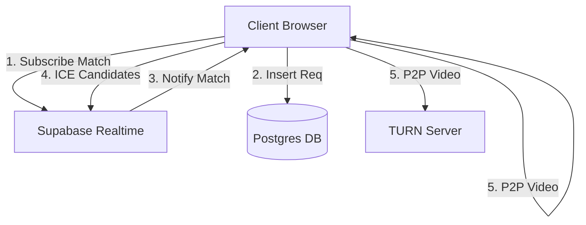

# Whispr — System Requirements Specification (SRS v5.0)

> [!NOTE]
> **Role:** Technical Implementation Guide
> **Scope:** Backend, Frontend, Infrastructure, and Security
> **Reference:** Works in tandem with [Whispr PRD v4.0](file:///c:/whispr/Whispr%20PRD.md)

---

## 1. System Architecture

### 1.1 High-Level Stack
| Component | Technology | Rationale |
| :--- | :--- | :--- |
| **Frontend** | React 18 + Vite | Fast HMR, lightweight bundle. |
| **State** | Zustand | Atomic state management (less boilerplate than Redux). |
| **Styling** | TailwindCSS | Utility-first, rapid UI iteration. |
| **Signaling** | Supabase Realtime (Postgres Changes) | Managed Websocket infrastructure, less ops. |
| **Database** | Postgres (Supabase) | ACID compliance for atomic matchmaking locks. |
| **Infrastructure** | Vercel (Edge Functions) | Low-latency static serving. |

### 1.2 Component Diagram


---

## 2. Database Schema (Postgres)

> [!IMPORTANT]
> The database is used ONLY for signaling and matchmaking. NO chat content is stored.

### 2.1 Table: `match_queue`
Active users waiting for a partner.
```sql
CREATE TABLE match_queue (
    id UUID PRIMARY KEY DEFAULT gen_random_uuid(),
    session_id UUID NOT NULL, -- Client-generated ephemeral ID
    created_at TIMESTAMP WITH TIME ZONE DEFAULT NOW(),
    last_ping TIMESTAMP WITH TIME ZONE DEFAULT NOW(),
    constraints JSONB DEFAULT '{}' -- { "has_video": true }
);

-- Index for FIFO matching
CREATE INDEX idx_queue_created ON match_queue (created_at ASC);
```

### 2.2 Table: `active_rooms`
Live connections.
```sql
CREATE TABLE active_rooms (
    id UUID PRIMARY KEY DEFAULT gen_random_uuid(),
    user_a_session UUID NOT NULL,
    user_b_session UUID NOT NULL,
    status TEXT DEFAULT 'active', -- 'active', 'ended'
    created_at TIMESTAMP DEFAULT NOW(),
    ended_at TIMESTAMP
);
```

### 2.3 Row Level Security (RLS)
-   **Public:** `INSERT` allowed on `match_queue`.
-   **Public:** `SELECT` allowed ONLY on rows where `session_id` matches user's session (via RLS policy).

---

## 3. Functional Requirements (Engineering)

### 3.1 FR-MATCH: Atomic Matchmaking (Postgres RPC)
**Requirement:** System must prevent "double-booking" of users and execute match logic atomically close to the data.
**Implementation:**
MUST use a Postgres Database Function (RPC) callable via Supabase client.
```sql
-- Function: match_user(my_session_id uuid)
BEGIN;
  -- 1. Try to find a partner (SKIP LOCKED is critical)
  SELECT session_id INTO partner_id 
  FROM match_queue
  WHERE session_id != my_session_id
  AND (constraints->>'has_video')::boolean = (my_constraints->>'has_video')::boolean
  ORDER BY created_at ASC
  LIMIT 1
  FOR UPDATE SKIP LOCKED;
  
  -- 2. If found, insert into active_rooms
  -- 3. Delete both from queue
  -- 4. Return room_id and partner_id
COMMIT;
```

### 3.2 FR-CLEANUP: Zombie Session Garbage Collection
**Requirement:** Rooms where a user disconnected without sending a signal must be closed.
**Implementation:**
Use `pg_cron` (if available) or a scheduled Edge Function.
-   **Schedule:** Every 1 minute.
-   **Logic:** `DELETE FROM match_queue WHERE last_ping < NOW() - INTERVAL '1 minute';`
-   **Logic:** `UPDATE active_rooms SET status = 'ended' WHERE last_ping < NOW() - INTERVAL '2 minutes';`

### 3.3 FR-RTC: WebRTC Configuration
**Media Constraints:**
-   **Video:** 720p (1280x720) maximum, 30fps.
-   **Audio:** Echo cancellation, Noise suppression enabled.
-   **ICE Servers Config:**
    ```javascript
    const peerConnectionConfig = {
        iceServers: [
            { urls: "stun:stun.l.google.com:19302" }, // Free STUN
            { 
                urls: process.env.VITE_TURN_URL,
                username: process.env.VITE_TURN_USER,
                credential: process.env.VITE_TURN_PASSWORD 
            }
        ]
    };
    ```

---

## 4. Environment Variables

The application requires the following environment variables to function:

| Variable | Description | Required? |
| :--- | :--- | :--- |
| `VITE_SUPABASE_URL` | Supabase Project URL | YES |
| `VITE_SUPABASE_ANON_KEY` | Supabase Public/Anon API Key | YES |
| `VITE_TURN_URL` | TURN Server URL (e.g. `turn:global.turn.twilio.com:3478`) | YES |
| `VITE_TURN_USER` | TURN Username | YES |
| `VITE_TURN_PASSWORD` | TURN Password | YES |

---

## 5. Security & Abuse Implementation

### 4.1 SEC-FP: Fingerprinting (Privacy-Light)
**Do NOT** use invasive canvas fingerprinting (GDPR risk + flaky).
**Strategy:** "Session + IP Subnet"
-   On Report: Store hash of `IP_Subnet( /24 ) + UserAgent`.
-   Logic: If > 3 reports from same Hash in 1 hour -> 24h Shadow Ban.
-   Storage: Redis (or Postgres with 24h TTL).

### 4.2 SEC-XSS: Input Sanitization
-   **Chat:** All text input MUST be sanitized on render.
-   **React:** Auto-escapes by default. Dangerous: `dangerouslySetInnerHTML` is STRICTLY PROHIBITED.

---

## 5. Error Handling & Edge Cases

| Error Code | Definition | UI Response |
| :--- | :--- | :--- |
| `ERR_NO_CAM` | Browser denied media access. | "We need camera access to video chat. Switch to Text Mode?" |
| `ERR_MATCH_TIMEOUT` | No match found in 30s. | "It's quiet right now. Keep waiting?" |
| `ERR_SIGNAL_DESYNC` | Received answer for unknown offer. | Silent Reset + Rematch. |
| `ERR_PEER_LEFT` | `iceConnectionState: closed` | "Stranger disconnected." (Show 'Find New' button) |

---

## 6. Test Plan (Automated)

### 6.1 Unit Tests (Vitest)
-   `matchQueue.test.ts`: Mock DB, ensure FIFO order.
-   `utils.test.ts`: Verify text sanitization functions.

### 6.2 E2E Tests (Playwright)
-   **Scenario:** Multi-tab Chating.
    1.  Open Browser A (User 1).
    2.  Open Browser B (User 2).
    3.  A & B click "Search".
    4.  Verify "Connected" state in both.
    5.  A types "Hello". Verify B sees "Hello".
    6.  A closes tab. Verify B sees "Partner Disconnected".

---
**Approvals:**
Security Architect: [Pending]
Backend Lead: [Pending]
